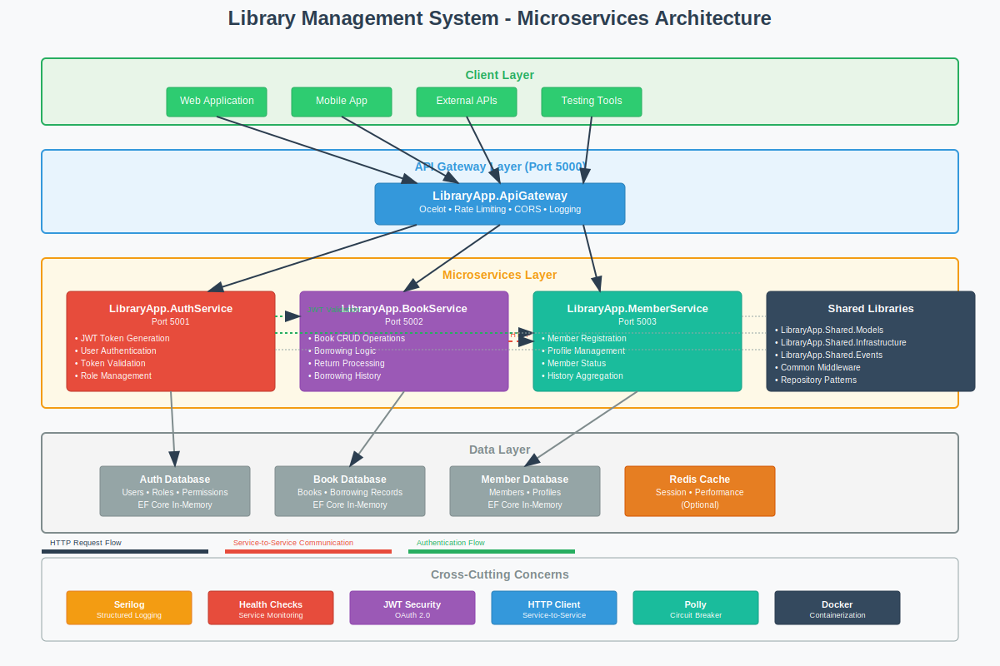

# 📚 Library Management System - Microservices Architecture
- Working with Claude prompt
[](https://github.com/navinprabhu/claude_libraryApp/actions)
[](https://opensource.org/licenses/MIT)
[](https://dotnet.microsoft.com/)
[](https://www.docker.com/)

A modern, cloud-ready Library Management System built with **microservices architecture** using .NET 8, featuring independent services for authentication, book management, and member operations.

## 🏗️ System Architecture



## 🌟 Features

### 🔐 **Authentication Service**
- JWT token-based authentication with OAuth 2.0
- Role-based access control (Admin, Member)
- Token validation and refresh mechanisms
- Secure password hashing with BCrypt

### 📖 **Book Management Service**
- Complete CRUD operations for books
- Book borrowing and return workflows
- ISBN validation and cataloging
- Borrowing history and audit trails

### 👥 **Member Management Service**
- Member registration and profile management
- Member status tracking (Active, Suspended, Inactive)
- Borrowing history aggregation
- Cross-service data synchronization

### 🌐 **API Gateway**
- Single entry point with Ocelot
- Request routing and load balancing
- Rate limiting and throttling
- CORS configuration and security policies

## 🛠️ Technology Stack

| Component | Technology | Purpose |
|-----------|------------|---------|
| **Framework** | .NET 8.0 | Core application framework |
| **Database** | Entity Framework Core | Data persistence layer |
| **Authentication** | JWT Bearer Tokens | Secure API access |
| **API Gateway** | Ocelot | Service orchestration |
| **Containerization** | Docker & Docker Compose | Local development & deployment |
| **Logging** | Serilog | Structured logging |
| **Testing** | xUnit + Moq | Unit and integration testing |
| **Communication** | HTTP Client + Polly | Inter-service communication |
| **Documentation** | Swagger/OpenAPI | API documentation |

## 🚀 Quick Start

### Prerequisites

- **Windows 10/11** (for local development)
- **Docker Desktop** for Windows
- **.NET 8 SDK**
- **Git** for Windows
- **Visual Studio 2022** or **VS Code**

### 🏃‍♂️ Running Locally

1. **Clone the repository**
   ```bash
   git clone https://github.com/navinprabhu/claude_libraryApp.git
   cd claude_libraryApp
   ```

2. **Setup local development environment**
   ```powershell
   .\scripts\setup-local-dev.ps1
   ```

3. **Build and run all services**
   ```powershell
   .\scripts\build-and-run.ps1
   ```

4. **Access the services**
   - **API Gateway**: http://localhost:5000
   - **Swagger UI**: http://localhost:5000/swagger
   - **Auth Service**: http://localhost:5001
   - **Book Service**: http://localhost:5002
   - **Member Service**: http://localhost:5003

### 🐳 Docker Development

```powershell
# Start all services with Docker Compose
docker-compose up -d

# View logs
docker-compose logs -f

# Stop all services
docker-compose down
```

## 📁 Project Structure

```
claude_libraryApp/
├── 📁 src/
│   ├── 📁 Services/
│   │   ├── 🔐 LibraryApp.AuthService/        # Authentication microservice
│   │   ├── 📚 LibraryApp.BookService/        # Book management microservice
│   │   ├── 👥 LibraryApp.MemberService/      # Member management microservice
│   │   └── 🌐 LibraryApp.ApiGateway/         # API Gateway with Ocelot
│   ├── 📁 Shared/
│   │   ├── 📄 LibraryApp.Shared.Models/      # Common DTOs and models
│   │   ├── 🛠️ LibraryApp.Shared.Infrastructure/ # Common utilities
│   │   └── 📡 LibraryApp.Shared.Events/      # Event models
│   └── 📁 Tests/
│       ├── 🧪 LibraryApp.AuthService.Tests/
│       ├── 🧪 LibraryApp.BookService.Tests/
│       ├── 🧪 LibraryApp.MemberService.Tests/
│       └── 🧪 LibraryApp.IntegrationTests/
├── 📁 docker/
│   ├── 🐳 docker-compose.yml               # Multi-service orchestration
│   ├── 🐳 docker-compose.override.yml      # Development overrides
│   └── 📁 Dockerfiles/                     # Individual service Dockerfiles
├── 📁 scripts/
│   ├── ⚡ setup-local-dev.ps1             # Environment setup
│   ├── 🔧 build-and-run.ps1               # Build and run all services
│   └── 🧹 clean.ps1                       # Cleanup containers and volumes
├── 📁 docs/
│   ├── 📊 architecture-diagram.svg         # System architecture diagram
│   ├── 📋 api-documentation/               # API specifications
│   └── 📖 deployment-guides/               # Deployment instructions
├── 📁 .github/
│   └── 📁 workflows/
│       ├── 🔄 ci.yml                       # Continuous Integration
│       └── 🚀 cd.yml                       # Continuous Deployment
└── 📄 LibraryApp.sln                       # Solution file
```

## 🔧 Service Endpoints

### 🔐 Authentication Service (Port 5001)
```http
POST   /api/auth/login          # User login
POST   /api/auth/validate       # Token validation
POST   /api/auth/refresh        # Refresh token
GET    /api/auth/userinfo       # Get user information
```

### 📚 Book Service (Port 5002)
```http
GET    /api/books               # Get all books
GET    /api/books/{id}          # Get book by ID
POST   /api/books               # Create new book [Admin]
PUT    /api/books/{id}          # Update book [Admin]
DELETE /api/books/{id}          # Delete book [Admin]
POST   /api/books/{id}/borrow   # Borrow book
POST   /api/books/{id}/return   # Return book
GET    /api/books/{id}/history  # Get borrowing history
```

### 👥 Member Service (Port 5003)
```http
GET    /api/members             # Get all members [Admin]
GET    /api/members/{id}        # Get member by ID
POST   /api/members             # Register new member
PUT    /api/members/{id}        # Update member profile
GET    /api/members/{id}/borrowed-books    # Get borrowed books
GET    /api/members/{id}/history           # Get borrowing history
```

## 🧪 Testing

### Run Unit Tests
```powershell
# Run all tests
dotnet test

# Run with coverage
dotnet test --collect:"XPlat Code Coverage"

# Run specific service tests
dotnet test src/Tests/LibraryApp.BookService.Tests/
```

### Integration Testing
```powershell
# Run integration tests with TestContainers
dotnet test src/Tests/LibraryApp.IntegrationTests/
```

## 📊 Monitoring & Observability

### Health Checks
- **Individual Services**: `http://localhost:{port}/health`
- **Aggregated**: `http://localhost:5000/health`

### Structured Logging
- **Console Output**: Development environment
- **File Logging**: `logs/` directory
- **Correlation IDs**: Request tracing across services

### Metrics (Future Enhancement)
- Application Performance Monitoring (APM)
- Custom business metrics
- Performance counters

## 🔒 Security Features

- **JWT Authentication**: Bearer token-based security
- **Role-Based Access**: Admin and Member roles
- **Input Validation**: Data annotation validation
- **HTTPS Enforcement**: Production-ready security
- **CORS Configuration**: Cross-origin request handling
- **Rate Limiting**: API throttling and abuse prevention

## 🌐 API Documentation

Interactive API documentation is available via Swagger UI:
- **Gateway Swagger**: http://localhost:5000/swagger
- **Individual Services**: Each service exposes its own Swagger endpoint

## 🔄 CI/CD Pipeline

### GitHub Actions Workflows

- **Continuous Integration** (`.github/workflows/ci.yml`)
  - Build all microservices
  - Run unit and integration tests
  - Build and test Docker containers
  - Code coverage reporting

- **Continuous Deployment** (`.github/workflows/cd.yml`)
  - Build production images
  - Deploy to staging environment
  - Run smoke tests
  - Deploy to production (manual approval)

## 🚀 Deployment

### Local Development
```powershell
docker-compose up -d
```

### Cloud Deployment
Supports deployment to major cloud providers:
- **Azure Container Instances**
- **AWS ECS/Fargate**
- **Google Cloud Run**
- **Kubernetes** (any provider)

See [deployment guides](docs/deployment-guides/) for detailed instructions.

## 🤝 Contributing

We welcome contributions! Please see our [Contributing Guidelines](CONTRIBUTING.md) for details.

### Development Workflow
1. Fork the repository
2. Create a feature branch (`git checkout -b feature/amazing-feature`)
3. Commit your changes (`git commit -m 'Add some amazing feature'`)
4. Push to the branch (`git push origin feature/amazing-feature`)
5. Open a Pull Request

### Code Standards
- Follow [Microsoft C# Coding Conventions](https://docs.microsoft.com/en-us/dotnet/csharp/programming-guide/inside-a-program/coding-conventions)
- Write unit tests for new functionality
- Update documentation as needed
- Ensure all CI checks pass

## 📋 API Examples

### Authentication
```bash
# Login to get JWT token
curl -X POST http://localhost:5000/api/auth/login \
  -H "Content-Type: application/json" \
  -d '{"username": "admin", "password": "password"}'

# Response
{
  "token": "eyJhbGciOiJIUzI1NiIsInR5cCI6IkpXVCJ9...",
  "expiration": "2024-01-01T12:00:00Z",
  "refreshToken": "..."
}
```

### Create a Book (Admin Only)
```bash
curl -X POST http://localhost:5000/api/books \
  -H "Authorization: Bearer {your-jwt-token}" \
  -H "Content-Type: application/json" \
  -d '{
    "title": "The Great Gatsby",
    "author": "F. Scott Fitzgerald",
    "isbn": "9780743273565"
  }'
```

### Borrow a Book
```bash
curl -X POST http://localhost:5000/api/books/1/borrow \
  -H "Authorization: Bearer {your-jwt-token}" \
  -H "Content-Type: application/json" \
  -d '{"memberId": 1}'
```

## 📄 License

This project is licensed under the MIT License - see the [LICENSE](LICENSE) file for details.

## 👨‍💻 Author

**Navin Prabhu**
- GitHub: [@navinprabhu](https://github.com/navinprabhu)
- Project: [claude_libraryApp](https://github.com/navinprabhu/claude_libraryApp)

## 🙏 Acknowledgments

- Built with guidance from Claude AI
- Inspired by modern microservices patterns
- Following .NET and Docker best practices

## 📞 Support

For support and questions:
- 🐛 **Bug Reports**: [Create an Issue](https://github.com/navinprabhu/claude_libraryApp/issues)
- 💡 **Feature Requests**: [Discussion Board](https://github.com/navinprabhu/claude_libraryApp/discussions)
- 📧 **Contact**: Open an issue for general questions

---

⭐ **Star this repository** if you find it helpful!

📚 **Happy coding and happy reading!** 📚
